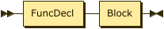
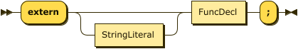
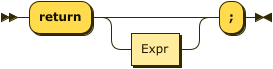
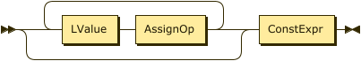

**Program:**


```
Program  ::= TopLevelDecl*
```

**TopLevelDecl:**


```
TopLevelDecl
         ::= UseDecl
           | FuncDef
           | ExternDecl
```

referenced by:

* Program

**UseDecl:**


```
UseDecl  ::= 'use' PkgId ( 'as' Ident )? ';'
```

referenced by:

* TopLevelDecl

**PkgId:**


```
PkgId    ::= Ident ( '.' Ident )*
```

referenced by:

* UseDecl

**Ident:**


```
Ident    ::= ( Letter | '_' ) ( Letter | Digit | '_' )*
```

referenced by:

* Decl
* FuncDecl
* Param
* PkgId
* Ref
* TailNoCall
* TailWithCall
* Type
* UseDecl

**Letter:**


```
Letter   ::= [A-Za-z]
```

referenced by:

* Ident

**DecDigit:**


```
DecDigit ::= [0-9]
```

referenced by:

* DecDigits

**DecDigits:**


```
DecDigits
         ::= DecDigit ( '_'? DecDigit )*
```

referenced by:

* DecimalInteger
* FloatLiteral

**HexDigit:**


```
HexDigit ::= [0-9A-Fa-f]
```

referenced by:

* HexDigits

**HexDigits:**


```
HexDigits
         ::= HexDigit ( '_'? HexDigit )*
```

referenced by:

* HexInteger

**BinDigit:**


```
BinDigit ::= [0-1]
```

referenced by:

* BinDigits

**BinDigits:**


```
BinDigits
         ::= BinDigit ( '_'? BinDigit )*
```

referenced by:

* BinInteger

**BooleanLiteral:**


```
BooleanLiteral
         ::= 'true'
           | 'false'
```

referenced by:

* Literal

**HexInteger:**


```
HexInteger
         ::= ( '0x' | '0X' ) HexDigits
```

referenced by:

* IntegerLiteral

**BinInteger:**


```
BinInteger
         ::= ( '0b' | '0B' ) BinDigits
```

referenced by:

* IntegerLiteral

**DecimalInteger:**


```
DecimalInteger
         ::= '0'
           | [1-9] DecDigits?
```

referenced by:

* FloatLiteral
* IntegerLiteral

**IntegerLiteral:**


```
IntegerLiteral
         ::= DecimalInteger
           | BinInteger
           | HexInteger
```

referenced by:

* Literal

**FloatLiteral:**


```
FloatLiteral
         ::= DecimalInteger? '.' DecDigits
```

referenced by:

* Literal

**StringLiteral:**


```
StringLiteral
         ::= '"' ( Escape | CharNoQuoteNoBackslash )* '"'
```

referenced by:

* ExternDecl
* Literal

**Escape:**


```
Escape   ::= '\' ( '"' | '\' | 'n' | 't' | 'r' )
```

referenced by:

* StringLiteral

**CharNoQuoteNoBackslash:**


```
CharNoQuoteNoBackslash
         ::= [^"\n]
```

referenced by:

* StringLiteral

**Literal:**


```
Literal  ::= BooleanLiteral
           | IntegerLiteral
           | FloatLiteral
           | StringLiteral
```

referenced by:

* Primary

**TypeArg:**


```
TypeArg  ::= Type
           | ConstExpr
```

referenced by:

* TypeArgList

**TypeArgList:**


```
TypeArgList
         ::= TypeArg ( ',' TypeArg )*
```

referenced by:

* Type

**Type:**


```
Type     ::= 'bool'
           | 'int8'
           | 'int16'
           | 'int32'
           | 'int64'
           | 'uint8'
           | 'uint16'
           | 'uint32'
           | 'uint64'
           | 'fp32'
           | 'fp64'
           | Ident ( '<' TypeArgList '>' )?
```

referenced by:

* Decl
* FuncDecl
* Param
* TypeArg

**Param:**


```
Param    ::= 'mut'? Type Ident
```

referenced by:

* ParamList

**ParamList:**


```
ParamList
         ::= Param ( ',' Param )*
```

referenced by:

* FuncDecl

**FuncDecl:**


```
FuncDecl ::= 'func' Ident '(' ParamList? ')' Type?
```

referenced by:

* ExternDecl
* FuncDef

**FuncDef:**



```
FuncDef  ::= FuncDecl Block
```

referenced by:

* TopLevelDecl

**ExternDecl:**



```
ExternDecl
         ::= 'extern' StringLiteral? FuncDecl ';'
```

referenced by:

* TopLevelDecl

**Decl:**


```
Decl     ::= 'mut'? ( Type | 'var' ) Ident
```

referenced by:

* DeclInit
* DeclStmt

**DeclInit:**


```
DeclInit ::= Decl '=' Expr
```

referenced by:

* ForInit

**DeclStmt:**


```
DeclStmt ::= Decl ( '=' Expr )? ';'
```

referenced by:

* Stmt

**Stmt:**


```
Stmt     ::= Block
           | DeclStmt
           | ExprStmt
           | IfStmt
           | WhileStmt
           | ForStmt
           | ReturnStmt
```

referenced by:

* Block
* ForStmt
* IfStmt
* WhileStmt

**Block:**


```
Block    ::= '{' Stmt* '}'
```

referenced by:

* FuncDef
* Stmt

**IfStmt:**


```
IfStmt   ::= 'if' '(' Expr ')' Stmt ( 'else' Stmt )?
```

referenced by:

* Stmt

**WhileStmt:**


```
WhileStmt
         ::= 'while' '(' Expr ')' Stmt
```

referenced by:

* Stmt

**ForStmt:**


```
ForStmt  ::= 'for' '(' ForInit ';' Expr? ';' ForStep ')' Stmt
```

referenced by:

* Stmt

**ForInit:**


```
ForInit  ::= ( DeclInit | Expr )?
```

referenced by:

* ForStmt

**ForStep:**


```
ForStep  ::= Expr?
```

referenced by:

* ForStmt

**ReturnStmt:**



```
ReturnStmt
         ::= 'return' Expr? ';'
```

referenced by:

* Stmt

**ExprStmt:**


```
ExprStmt ::= Expr ';'
```

referenced by:

* Stmt

**TailNoCall:**


```
TailNoCall
         ::= ( '.' Ident | '[' Expr ']' )*
```

referenced by:

* Ref

**TailWithCall:**


```
TailWithCall
         ::= '(' ArgList? ')' ( '.' Ident | '[' Expr ']' | '(' ArgList? ')' )*
```

referenced by:

* ParenWithCall
* PlaceWithCall

**Ref:**


```
Ref      ::= Ident TailNoCall
```

referenced by:

* LValue
* PlaceWithCall

**LValue:**


```
LValue   ::= Ref
```

referenced by:

* Expr
* IncDecPrefix
* Postfix

**PlaceWithCall:**


```
PlaceWithCall
         ::= Ref TailWithCall
```

referenced by:

* Postfix

**ParenWithCall:**


```
ParenWithCall
         ::= '(' Expr ')' TailWithCall
```

referenced by:

* Postfix

**ArgList:**


```
ArgList  ::= Expr ( ',' Expr )*
```

referenced by:

* TailWithCall

**PostSuffix:**


```
PostSuffix
         ::= '++'
           | '--'
```

referenced by:

* Postfix

**Primary:**


```
Primary  ::= Literal
           | '(' Expr ')'
```

referenced by:

* Postfix

**Postfix:**


```
Postfix  ::= LValue PostSuffix?
           | PlaceWithCall
           | ParenWithCall
           | Primary
```

referenced by:

* Prefix

**IncDecPrefix:**


```
IncDecPrefix
         ::= ( '++' | '--' ) LValue
```

referenced by:

* Prefix

**Prefix:**


```
Prefix   ::= ( '+' | '-' | '!' | '~' )* ( IncDecPrefix | Postfix )
```

referenced by:

* Mul

**Mul:**


```
Mul      ::= Prefix ( ( '*' | '/' | '%' ) Prefix )*
```

referenced by:

* Add

**Add:**


```
Add      ::= Mul ( ( '+' | '-' ) Mul )*
```

referenced by:

* Shift

**Shift:**


```
Shift    ::= Add ( ( '<<' | '>>' ) Add )*
```

referenced by:

* Rel

**Rel:**


```
Rel      ::= Shift ( ( '<' | '<=' | '>' | '>=' ) Shift )*
```

referenced by:

* Equality

**Equality:**


```
Equality ::= Rel ( ( '==' | '!=' ) Rel )*
```

referenced by:

* LogicAnd

**LogicAnd:**


```
LogicAnd ::= Equality ( '&&' Equality )*
```

referenced by:

* LogicOr

**LogicOr:**


```
LogicOr  ::= LogicAnd ( '||' LogicAnd )*
```

referenced by:

* ConstExpr

**ConstExpr:**


```
ConstExpr
         ::= LogicOr ( '?' Expr ':' LogicOr )*
```

referenced by:

* Expr
* TypeArg

**AssignOp:**


```
AssignOp ::= '='
           | '+='
           | '-='
           | '*='
           | '/='
           | '%='
           | '<<='
           | '>>='
           | '&='
           | '^='
           | '|='
```

referenced by:

* Expr

**Expr:**



```
Expr     ::= ( LValue AssignOp )* ConstExpr
```

referenced by:

* ArgList
* ConstExpr
* DeclInit
* DeclStmt
* ExprStmt
* ForInit
* ForStep
* ForStmt
* IfStmt
* ParenWithCall
* Primary
* ReturnStmt
* TailNoCall
* TailWithCall
* WhileStmt

##  
 <sup>generated by [RR - Railroad Diagram Generator][RR]</sup>

[RR]: https://www.bottlecaps.de/rr/ui