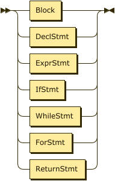
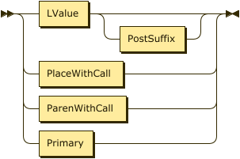

**Program:**


```
Program  ::= TopLevelDecl*
```

**TopLevelDecl:**


```
TopLevelDecl
         ::= UseDecl
           | FuncDef
           | ExternDecl
```

referenced by:

* Program

**UseDecl:**


```
UseDecl  ::= 'use' PkgId ( 'as' Ident )? ';'
```

referenced by:

* TopLevelDecl

**PkgId:**


```
PkgId    ::= Ident ( '.' Ident )*
```

referenced by:

* UseDecl

**Type:**


```
Type     ::= 'bool'
           | 'int8'
           | 'int16'
           | 'int32'
           | 'int64'
           | 'uint8'
           | 'uint16'
           | 'uint32'
           | 'uint64'
           | 'fp32'
           | 'fp64'
```

referenced by:

* DeclInit
* DeclStmt

**DeclStmt:**


```
DeclStmt ::= 'mut'? ( Type | 'var' ) Ident ( '=' Expr )? ';'
```

referenced by:

* Stmt

**Stmt:**



```
Stmt     ::= Block
           | DeclStmt
           | ( AssignStmt | ExprStmt | ReturnStmt ) ';'
           | IfStmt
           | WhileStmt
           | ForStmt
           | TernaryStmt
```

referenced by:

* Block
* ForStmt
* IfStmt
* TernaryStmt
* WhileStmt

**Block:**


```
Block    ::= '{' Stmt* '}'
```

referenced by:

* FuncDef
* Stmt

**AssignStmt:**


```
AssignStmt
         ::= Place AssignOp Expr
```

referenced by:

* ForInit
* ForStep
* Stmt

**AssignOp:**


```
AssignOp ::= '='
           | '+='
           | '-='
           | '*='
           | '/='
           | '%='
           | '<<='
           | '>>='
           | '&='
           | '^='
           | '|='
```

referenced by:

* AssignStmt

**Place:**


```
Place    ::= Ident
```

referenced by:

* AssignStmt
* IncDecPrefix
* Postfix

**ExprStmt:**


```
ExprStmt ::= Expr
```

referenced by:

* Stmt

**TernaryStmt:**


```
TernaryStmt
         ::= Expr '?' Stmt ':' Stmt
```

referenced by:

* Stmt

**IfStmt:**


```
IfStmt   ::= 'if' '(' Expr ')' Stmt ( 'else' Stmt )?
```

referenced by:

* Stmt

**WhileStmt:**


```
WhileStmt
         ::= 'while' '(' Expr ')' Stmt
```

referenced by:

* Stmt

**ForStmt:**


```
ForStmt  ::= 'for' '(' ForInit ';' Expr? ';' ForStep ')' Stmt
```

referenced by:

* Stmt

**ForInit:**


```
ForInit  ::= ( DeclInit | AssignStmt )?
```

referenced by:

* ForStmt

**DeclInit:**


```
DeclInit ::= 'mut'? ( Type | 'var' ) Ident '=' Expr
```

referenced by:

* ForInit

**ForStep:**


```
ForStep  ::= AssignStmt?
```

referenced by:

* ForStmt

**ReturnStmt:**


```
ReturnStmt
         ::= 'return' Expr?
```

referenced by:

* Stmt

**Expr:**


```
Expr     ::= LogicOr
```

referenced by:

* AssignStmt
* DeclInit
* DeclStmt
* ExprStmt
* ForStmt
* IfStmt
* Primary
* ReturnStmt
* TernaryStmt
* WhileStmt

**LogicOr:**


```
LogicOr  ::= LogicAnd ( '||' LogicAnd )*
```

referenced by:

* Expr

**LogicAnd:**


```
LogicAnd ::= BitOr ( '&&' BitOr )*
```

referenced by:

* LogicOr

**BitOr:**


```
BitOr    ::= BitXor ( '|' BitXor )*
```

referenced by:

* LogicAnd

**BitXor:**


```
BitXor   ::= BitAnd ( '^' BitAnd )*
```

referenced by:

* BitOr

**BitAnd:**


```
BitAnd   ::= Equality ( '&' Equality )*
```

referenced by:

* BitXor

**Equality:**


```
Equality ::= Rel ( ( '==' | '!=' ) Rel )*
```

referenced by:

* BitAnd

**Rel:**


```
Rel      ::= Shift ( ( '<' | '<=' | '>' | '>=' ) Shift )*
```

referenced by:

* Equality

**Shift:**


```
Shift    ::= Add ( ( '<<' | '>>' ) Add )*
```

referenced by:

* Rel

**Add:**


```
Add      ::= Mul ( ( '+' | '-' ) Mul )*
```

referenced by:

* Shift

**Mul:**


```
Mul      ::= Prefix ( ( '*' | '/' | '%' ) Prefix )*
```

referenced by:

* Add

**Prefix:**


```
Prefix   ::= ( '+' | '-' | '!' | '~' )* ( IncDecPrefix | Postfix )
```

referenced by:

* Mul

**IncDecPrefix:**


```
IncDecPrefix
         ::= ( '++' | '--' ) Place
```

referenced by:

* Prefix

**Postfix:**



```
Postfix  ::= Place PostOp*
           | Primary
```

referenced by:

* Prefix

**PostOp:**


```
PostOp   ::= '++'
           | '--'
```

referenced by:

* Postfix

**Primary:**


```
Primary  ::= Ident
           | Literal
           | '(' Expr ')'
```

referenced by:

* Postfix

**FuncDef:**


```
FuncDef  ::= 'func' Ident '(' ParamList? ')' RetType Block
```

referenced by:

* TopLevelDecl

**ExternDecl:**


```
ExternDecl
         ::= 'extern' StringLiteral? 'func' Ident '(' ParamList? ')' R
```

referenced by:

* TopLevelDecl

##  

 <sup>generated by [RR - Railroad Diagram Generator][RR]</sup>

[RR]: https://www.bottlecaps.de/rr/ui